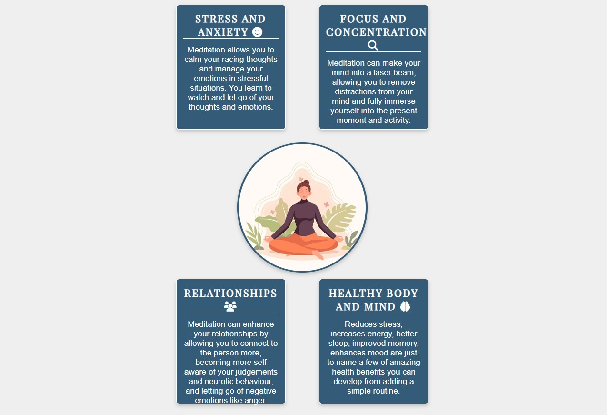

# Spiritual Journey
(Developer Dillon Mc Caffrey)

[Live Site](https://dmccaffrey01.github.io/CI_PP1_SPIRITUAL_JOURNEY/) is hosted on Github Pages

## Table of Content

1. [Project Goals](#project-goals)
    1. [User Goals](#user-goals)
    2. [Site Owner Goals](#site-owner-goals)
2. [User Experience](#user-experience)
    1. [Target Audience](#target-audience)
    2. [User Requrements and Expectations](#user-requrements-and-expectations)
    3. [User Stories](#user-stories)
3. [Design](#design)
    1. [Design Choices](#design-choices)
    2. [Colour](#colours)
    3. [Fonts](#fonts)
    4. [Structure](#structure)
    5. [Wireframes](#wireframes)
4. [Technologies Used](#technologies-used)
    1. [Languages](#languages)
    2. [Frameworks & Tools](#frameworks-&-tools)
5. [Features](#features)
6. [Testing](#validation)
    1. [HTML Validation](#HTML-validation)
    2. [CSS Validation](#CSS-validation)
    3. [Accessibility](#accessibility)
    4. [Performance](#performance)
    5. [Device testing](#performing-tests-on-various-devices)
    6. [Browser compatibility](#browser-compatability)
    7. [Testing user stories](#testing-user-stories)
8. [Bugs](#Bugs)
9. [Deployment](#deployment)
10. [Credits](#credits)
11. [Acknowledgements](#acknowledgements)

## Project Goals

### User Goals
- Find information on meditation, mindfulness and enlightenment
- Learn about meditation techniques and follow a beginners guide
- Find information on books, apps, and retreats
- Find out about Spiritual Journey

### Site Owner Goals
- Increase the amount of people practicing and learning about spirituality
- Provide useful and valuable information about spirituality
- Provide a place where anyone can come to learn more about spiritual topics
- Allow new and existing users to contact the company

## User Experience

### Target Audience
- People who are completely new and have never heard about meditation and spirituality
- People who are beginning their spiritual journey and need help
- Experienced pracitioners of meditation who want valuable resources and information

### User Requirements and Expectations

- Information can be found with ease and quickly
- Visually appealing design and layout on any screen size
- Simple and fully functioning website including links and navigation
- Easy way to get in contact with the company
- Accessibility

### User Stories

#### Beginner Meditator/First-time User
1. As a beginner meditator/first-time user, I want information on meditation,mindfulness and enlightenment, So that I can learn about these topics
2. As a beginner meditator/first-time user, I want information about what this company/website is about, So that I can understand what to do on this website
3. As a beginner meditator/first-time user, I want to go to the company’s social media, So that I can learn more about the company
4. As a beginner meditator/first-time user, I want to be able to have contact information of the company, So that I can contact and get help from the company
5. As a beginner meditator/first-time user, I want information on the benefits of doing these practises, So that I can choose whether to practise and learn more

#### Experienced Meditator/Returning User
6. As a experienced meditator/returning user, I want information on meditation techniques, So that I can learn and practise
7. As a experienced meditator/returning user, I want book recommendations on these topics, So that I can continue to learn and practise more
8. As a experienced meditator/returning user, I want app recommendations and info, So that I can continue to learn and practise more
9.  I want retreat recommendations and info, So that I can further my progress
10. As a experienced meditator/returning user, I want a feature where I can receive more information on a weekly basis, So that I can continue to learn and practise more
11. As a experienced meditator/returning user, I want a beginners guide to enlightenment and a pathway, So that I can comeback and use this resource along my journey
12. As a experienced meditator/returning user, I want a enlightenment map, So that I can check my progress

#### Site Owner
13. As the site owner, I want users to have an easy time navigating the website and finding information, So that they return back to the website
14. As the site owner, I want users to have a way of contacting and knowing the location of the company, So they can ask questions and find help
15. AS the site owner, I want the users to know what the company is about and what service the company provides, So they can trust and return back to the website

## Design

### Design Selection
The website was designed to have a feeling of the open sky, with lots of space being calm and pleasent to look at like a calm mind after meditation.

### Colour
The colour scheme is a relaxing gray and blue to represent the sky and clouds which resembles the activity of our minds. I choose the colour scheme and tested the contrast using WebAIM.

### Fonts
Google Fonts were used throughout the whole page.
Playfair Display was used for h1 and h2 headings including the logo with sans-serif as a fallback.
Source-Sans-Pro was used for the body with sans-serif as a fallback.

### Structure
The page is strucutred in a well known, recognizable, user friendly, and easy to learn way. When reaching the website the user sees the company logo on the left and a navigation menu button on the right.
The website has 4 seperate pages and 1 404 error page rerouting the user back to the home page.
- Home page with welcome hero image, introduction, definitions, benefits, and call to actions to advance further on the website
- About us page describing our mission, a newsletter subscription modal and a contact section which includes email, socials and location
- Techniques & Guide page with useful practice information, subscription modal, and call to actions
- Resources page with book and app recommendations, retreats info, maps info, and youtube links

### Wireframes

Wireframes were created mobile first and outline the initial design concept for the website
 

Home Page Wireframe

 

 

About Us Page Wireframe

 

 

Techniques Page Wireframe

 

 

Resources Page Wireframe

 

 

404 Error Page Wireframe

 

 

## Technologies Used

### Languages
- HTML
- CSS

### Frameworks & Tools
[Balsamiq](https://balsamiq.com/wireframes/) - Used to for wireframes.

[Github](https://github.com/) - To save and store the files for the website and for version control.

[Github Pages](https://pages.github.com/) (Jekyll) - to host the site 

[W3C validator](https://validator.w3.org/) - to test for syntax errors in HTML code

[Jigsaw CSS validator](https://jigsaw.w3.org/css-validator/) - check for syntactic errors in the css code 

[WAVE Web Accessibility Evaluation Tool](https://wave.webaim.org/) - check accessibility

[Google Fonts](https://fonts.google.com/about) - fonts used on the website were imported from here

[Font Awesome](https://fontawesome.com/search) - for iconography on the website

[Google Dev Tools](https://developer.chrome.com/docs/devtools/) - troubleshooting and testing features as well as implement responsive styling

[GitPod](https://www.gitpod.io/) - for active development 

[Tiny PNG](https://tinypng.com/) - compressing images.

[Favicon.io](https://favicon.io/) - create favicon.

[Am I Responsive?](https://ui.dev/amiresponsive) - prototyping website image on a range of devices.

## Features
The website consists of five pages, four are accessible through the navigation menu (index/home page, about-us page, techniques page, resouces page). The last page is a 404 error page which the user can click a button to return home.

### Logo and Navigation Bar
- Featured on all five pages
- The Logo when clicked brings the user back to the home page
- The navbar is uses a hamburger menu that when clicked opens a transparent dropdown menu with links to the home, about us, techniques and resources pages
- It is easy for the user to navigate through the website
- The page the user is currently on gets underlined

### Hero Image
- Introduces the user to the website
- Includes quote to make user feel welcome

### Intro and Descriptions
- Gives the user brief information on meditation and minfulness
- There is a three read buttons on each heading that when clicked expands the information so the user can read more
- There is a button when the text expands to close the information
- There is also a button under the intro information that when clicked links the user to the about us page
- A quote from Alan Watts is at the end of the section
- User stories covered: 1

### Benefits 
- Gives the user information on benefits of mediation
- It is collapsed to begin with just some sampled text and button but the user can click the read button to expand the section
- In the expanded section there is four cards with information on the benefits with a central image
- The expanded section can be closed with a button
- User stories covered: 5

### Continue Further
- The user is offered with a choice, to continue learning about spirituality and explore more of the website or return back to watching cat videos on youtube
- An image of Morphius from The Matrix offering two pills, the red pill or button links the user to the techniques page, the blue pill or button links the user to cat videos on youtube

### Footer
- The footer allows the user to go to the company's social media
- There is four links to facebook, twitter, instagram and youtube
- Copyright is also included
- User stories covered: 3

